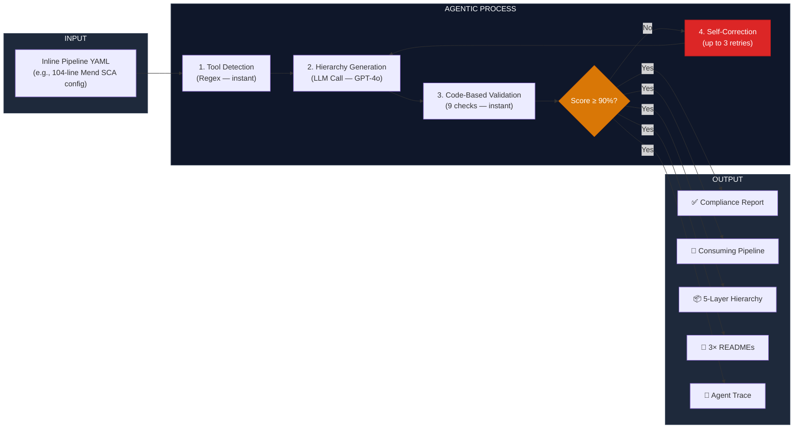
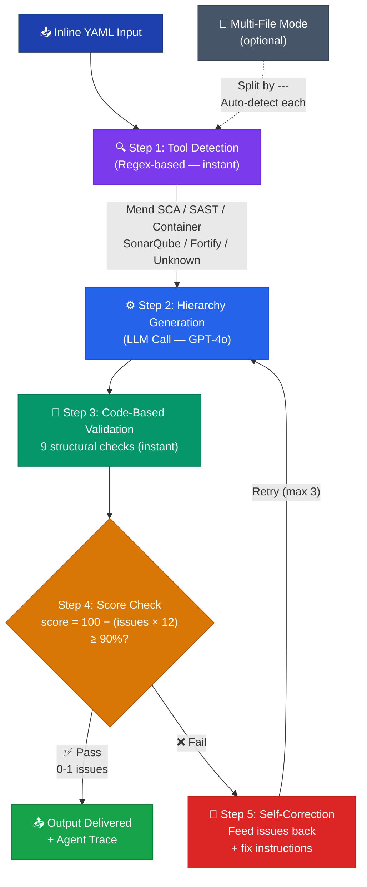
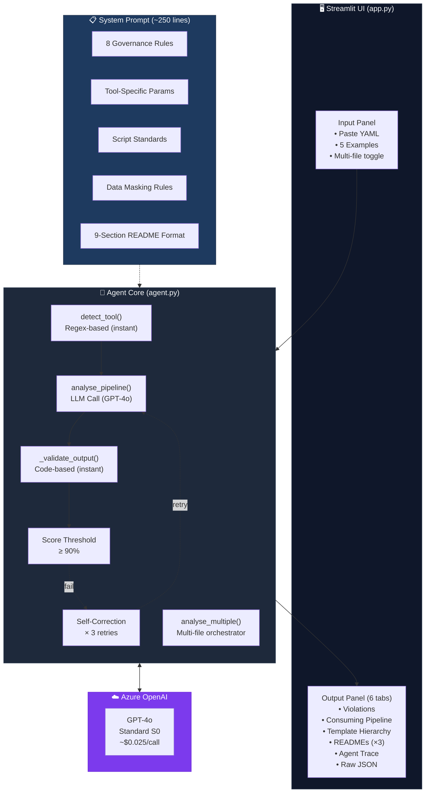

# 🛡️ Pipeline Governance Compliance Agent

**An agentic AI proof-of-concept that reads inline Azure DevOps pipeline YAML, identifies governance violations, and auto-generates a compliant CI/CD template hierarchy with self-validation and iterative correction — automating what took 8 months to do manually.**

> CSC3101 Capstone Project Extension — SIT-University of Glasgow
> Jiang Weimin

🔗 **Live Demo:** [coe-compliance-agent.streamlit.app](https://coe-compliance-agent.streamlit.app)

---

## Capstone Context

This PoC extends the **"Centralised CI/CD CoE Template Framework for DevSecOps Governance"** capstone project. Over an 8-month industry placement at a government statutory board, the capstone delivered a centralised, parameterised YAML template framework on Azure DevOps that:

- Migrated ~55 application repositories from fragmented inline pipeline configurations to a reusable 5-layer template hierarchy (Pipelines → Stages → Jobs → Tasks → Scripts)
- Integrated 4 security tools: **SonarQube**, **Mend CLI** (SCA, SAST, Container Scanning), **BuildKit**, and **GitVersion**
- Achieved **30–87% configuration reduction** across all tools
- Established a **default-secure governance model** (`enableFailPolicy = true` by default)

### Problem Statements Addressed

| # | Sub-Problem | What This PoC Demonstrates |
|---|---|---|
| SP1 | **Configuration Duplication** across ~55 repos | The agent reproduces the same 30–87% reduction achieved manually — proving the governance rules are machine-enforceable |
| SP2 | **Absence of Governance** for pipeline organisation, naming, documentation | The agent generates compliant templates, scripts, and 9-section READMEs following the exact CoE documentation standard |
| SP3 | **Incomplete Security Integration** — SAST and container scanning were absent | The agent handles all 4 tool types (SonarQube, Mend SCA, Mend SAST, Container) and can generalise to unknown tools (e.g., Fortify) |

This PoC validates the **Chapter 6.5 future work recommendation**: *"AIOps / Agentic AI — AI agent reads repo pipelines, auto-generates CoE-compliant templates following governance standards."*

---

## What It Does

The agent takes raw inline Azure DevOps pipeline YAML (the "before" state) and produces:



### Example: Mend SCA Migration

**Before (104 lines inline):**
- Hardcoded credentials in YAML variables
- Manual WhiteSource Unified Agent download + config file
- Inline report parsing, artifact staging, policy enforcement
- No SBOM generation, no reachability analysis
- **Compliance score: ~5%**

**After (17 lines template reference):**
- Credentials from Key Vault via variable groups
- Single template call to `mend_sca_orchestrator_task.yaml`
- Automatic PDF report, SBOM (CycloneDX/SPDX), reachability analysis
- Three-step deferred enforcement: scan → publish → check
- **Compliance score: 95–100%**

**Result: 83% configuration reduction (DS-01)**

---

## How It Is Agentic

This is not a single LLM prompt-and-response. The agent uses a **hybrid architecture**: fast code-based checks for deterministic validation (tool detection via regex, structural validation via Python) combined with LLM for creative generation (hierarchy, scripts, READMEs). This gives the best of both worlds — speed + reliability for validation, creativity for generation.



**Example self-correction progression:**

| Attempt | Issues Found | Computed Score | Result |
|---|---|---|---|
| 1 | 6 issues | 28% | ❌ Self-correct |
| 2 | 3 issues | 64% | ❌ Self-correct |
| 3 | 1 issue | 88% | ❌ Self-correct |
| 4 | 0 issues | 100% | ✅ Pass |

The **Agent Trace** tab in the UI shows the full execution trace: which tool was detected, compliance score per attempt, what issues were found, and how they were corrected.

---

## Architecture



---

## Tech Stack

| Component | Technology | Purpose |
|---|---|---|
| **LLM** | Azure OpenAI GPT-4o | YAML analysis, hierarchy generation, validation |
| **Backend** | Python 3.12 | Agent core, API orchestration, agentic loop |
| **Frontend** | Streamlit | Interactive web UI with 6-tab results display |
| **Hosting** | Streamlit Community Cloud | Free deployment with GitHub auto-deploy |
| **Secrets** | Streamlit Secrets + python-dotenv | API key management (cloud + local) |
| **CI/CD Platform** (capstone) | Azure DevOps | Where the actual CoE templates run |
| **Security Tools** (capstone) | SonarQube, Mend CLI, BuildKit, GitVersion | What the templates integrate |

---

## Demo Examples

The app includes 5 pre-loaded examples:

| Example | Tool | Lines (Before → After) | Expected Reduction |
|---|---|---|---|
| Mend SCA (104 lines) | Mend SCA | 104 → 17 | ~83% |
| SonarQube CLI (20 lines) | SonarQube | 20 → 10 | ~50% |
| Mend SAST (148 lines) | Mend SAST | 148 → 19 | ~87% |
| Container Scanning (175 lines) | Container | 175 → 24 | ~86% |
| Multi-Tool (3 files) | SonarQube + SAST + Container | 3 separate analyses | Varies |

The **Multi-Tool** example demonstrates autonomous tool detection — the agent receives 3 YAML blocks separated by `---` and independently classifies and processes each one.

---

## Project Files

```
coe-compliance-agent/
├── agent.py            # Agent core — agentic loop, tool detection, self-validation,
│                       #   score threshold check, multi-file analysis
├── app.py              # Streamlit UI — input panel, 6 results tabs
├── requirements.txt    # Python dependencies
├── .gitignore          # Excludes .env, venv/, __pycache__/
└── README.md           # This file
```

### `agent.py` — Agent Core

The brain of the system. Key components:

- **`get_secret()`** — reads from Streamlit secrets (cloud) or `.env` (local), enabling the same code to run in both environments
- **`SYSTEM_PROMPT`** — ~250 lines encoding all 8 CoE governance rules, tool-specific parameter sets, script structure standards (Constants → Derived values → Logging helpers → Functions → Main), naming conventions, data masking rules, 9-section README format, and output JSON schema
- **`VALIDATION_PROMPT`** — auditor prompt that checks generated output against 9 structural criteria
- **`DETECTION_PROMPT`** — fast classifier for tool type (Mend SCA, SAST, Container, SonarQube, Fortify, Unknown)
- **`detect_tool()`** — regex-based tool classification (instant, no LLM call): matches keywords to identify Mend SCA, SAST, Container, SonarQube, Fortify, or Unknown
- **`analyse_pipeline()`** — the main agentic loop:
  1. Detect tool type (regex — instant)
  2. Generate compliant hierarchy (LLM call — GPT-4o)
  3. Validate output (code-based — 9 structural checks, instant)
  4. Compute compliance score from issues (`100 - issues × 12`)
  5. If score < 90% or structural issues found → feed issues back → retry (up to 3×)
- **`_validate_output()`** — code-based validation (instant, no LLM call): checks compliant_yaml populated, all hierarchy levels present, bash steps in orchestrator, script structure, no sensitive data leaks, READMEs complete, no parameter cross-contamination, reduction calculation correct
- **`analyse_multiple()`** — splits multi-file input by `---`, processes each with full agentic loop

### `app.py` — Streamlit UI

The presentation layer. Features:

- **Sidebar:** 5 example loader (4 single-tool + 1 multi-tool), multi-file toggle (auto-enables for Multi-Tool), hierarchy diagram
- **Input panel:** YAML text area
- **Metrics row (5 cards):**
  - Tool Detected
  - Compliance Before (red/amber/green colour-coded)
  - Compliance After (green if ≥90%)
  - Lines Before → After
  - Config Reduction %
- **Configuration Reduction bar** — colour-coded (green ≥70%, amber ≥40%, red <40%)
- **Output tabs:**
  - 🚨 **Violations** — governance violations with severity badges (CRITICAL/HIGH/MEDIUM/LOW)
  - ✅ **Consuming Pipeline** — the template reference YAML that replaces the inline config
  - 📦 **Template Hierarchy** — full 5-layer output: Stage → Job → Task → Scripts, with call chain arrows and colour-coded hierarchy badges
  - 📖 **READMEs** — 3 READMEs (stage, job, task) each with 9 sections (Overview, Prerequisites, Parameters, Flow, Output, Variables, Secrets, Usage Examples, Error Handling)
  - 🤖 **Agent Trace** — agentic execution log: tool detected, attempts count, self-validated status, compliance score per attempt, issues found per attempt, agent decision flow
  - 🔧 **Raw JSON** — complete agent response for debugging

---

## CoE Governance Rules (Encoded in System Prompt)

| # | Rule | What It Enforces |
|---|---|---|
| 1 | Template Distribution | All scanning via shared `resources: repositories` — no inline configs |
| 2 | Parameter Naming | Standardised tool-specific names (`userKey`, `email`, `apiKey`, `enableFailPolicy`, etc.) — no cross-tool contamination |
| 3 | Template Hierarchy | 5-layer: Pipelines → Stages → Jobs → Tasks → Scripts. Naming: `technology_verb_{scope}_type.yaml` |
| 4 | Script Architecture | Three-step deferred enforcement: scan → publish (continueOnError) → check. Exit code 9 = policy violation. Scripts follow: Constants → Derived values → Logging helpers → Functions → Main |
| 5 | Default-Secure | `enableFailPolicy: true` by default — must explicitly opt out |
| 6 | Credential Management | All secrets from Azure Key Vault via Library variable groups — no hardcoded credentials |
| 7 | Documentation Standard | 9-section README per template (Overview, Prerequisites, Parameters, Flow, Output, Variables, Secrets, Usage, Error Handling) |
| 8 | Artefact Publishing | SCA: PDF + SBOM + reachability. SAST: JSON + HTML. Container: JSON + SARIF + SPDX + CycloneDX |

---

## Agentic Validation Criteria

The validation is **code-based** (Python, not LLM) — this ensures deterministic, consistent, and instant checks with no LLM variance:

1. `compliant_yaml` is populated and contains `resources: repositories`
2. `template_files` contains stage, job, task, and script entries
3. Orchestrator task calls scripts via `- bash:` steps (not `- template:`)
4. Scripts follow structure: Constants → Derived values → Logging helpers → Functions → Main
5. Scripts use `#!/bin/bash` and `set -euo pipefail`
6. No sensitive identifiers leak (no real org names, internal prefixes, credential variable names)
7. `readme_files` has 3 entries (stage, job, task) each with non-empty content
8. Parameters are tool-specific — no cross-contamination
9. `reduction_percentage` calculation is correct

The compliance score is **computed from the validator**, not self-reported by the generation model:

```
compliance_score_after = 100 - (number_of_issues × 12)
```

This prevents the model from inflating its own score. The threshold to pass is **≥ 90%** (0–1 issues).

---

## Dependencies

```
openai          # Azure OpenAI Python SDK
streamlit       # Web UI framework
pyyaml          # YAML parsing
python-dotenv   # Local .env file loading
```

Install locally:
```bash
python -m venv venv
venv\Scripts\activate        # Windows
source venv/bin/activate     # macOS/Linux
pip install -r requirements.txt
```

---

## Setup

### 1. Azure OpenAI Resource

- Create an Azure OpenAI resource (Standard S0)
- Deploy GPT-4o model
- Note your endpoint URL and API key

### 2. Local Development

Create a `.env` file:
```properties
AZURE_OPENAI_ENDPOINT=https://your-resource.openai.azure.com/
AZURE_OPENAI_API_KEY=your-api-key
AZURE_OPENAI_DEPLOYMENT=gpt-4o
AZURE_OPENAI_API_VERSION=2024-12-01-preview
```

Run:
```bash
streamlit run app.py
```

### 3. Streamlit Cloud Deployment

1. Push code to GitHub (private or public repo)
2. Go to [share.streamlit.io](https://share.streamlit.io)
3. Connect your repo, set `app.py` as main file
4. Add secrets in Settings → Secrets (TOML format):
```toml
AZURE_OPENAI_ENDPOINT = "https://your-resource.openai.azure.com/"
AZURE_OPENAI_API_KEY = "your-api-key"
AZURE_OPENAI_DEPLOYMENT = "gpt-4o"
AZURE_OPENAI_API_VERSION = "2024-12-01-preview"
```

---

## Cost

| Component | Cost |
|---|---|
| Azure OpenAI GPT-4o | ~$0.025 per attempt (1 LLM call per attempt) |
| Streamlit Community Cloud | Free |
| Single analysis with retries | ~$0.05–0.10 (1–4 attempts) |
| Multi-tool analysis (3 files) | ~$0.15–0.30 per run |
| 200 test/demo calls | ~$5–15 |
| **Total PoC budget** | **< $15 out of $100 student credits** |

---

## Future Work

This PoC is Phase 1 of the agentic AI vision. The roadmap:

| Phase | Capability | Status |
|---|---|---|
| Phase 1 (current) | GenAI compliance analysis with agentic self-validation loop | ✅ Complete |
| Phase 2 | Azure DevOps API integration — agent reads repos directly | Planned |
| Phase 3 | Autonomous PR generation — agent creates PRs with compliant YAML | Planned |
| Phase 4 | Continuous monitoring — agent runs on every PR as a pipeline extension | Planned |

---

## Acknowledgements

- **Industry Supervisor** — [Organisation] Cloud Services & Support
- **Academic Supervisor** — University of Glasgow
- **CloudOps Team** — Template testing and adoption feedback

---

## License

This project is part of the CSC3101 Capstone Project for academic purposes. Not licensed for commercial use.